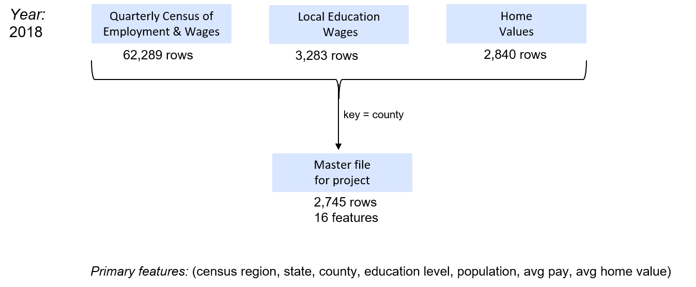

Final_Project_Presentation
Home Values
========================================================
author: Ken Popkin
css: custom.css
date: April 20, 2020
autosize: true
font-family: Calibri

Contents
========================================================

- Introduction
- About the Data
- Correlations
- Scatterplots
- Regression Results

Introduction
========================================================
<I> <del> Can education and wages be used as predictors for home values? </del> </I>
<br> <br>
There are many factors theorized to influence a home's value and for this project we'll attempt to answer if two popular topics, education and wages, can be used as predictors for a third popular topic, home values.
<br> <br>
<B> Features </B>    
<I> Education: </I><small> HS dropout, HS diploma, some college, four year degree</small> <br> 
<I> Wages: </I> <small> average annual wage </small> <br>
<I> Geography: </I> <small> county, state, and census regions </small>

<B> Predict </B  <br> <br>
<I> Home Values: </I> <small> average home value for each county </small>   

About the Data
========================================================



Correlations
========================================================


The heat map shows correlations of 52, 39, and 69% for avg annual pay, population, and college degree respectively.


Scatterplots
========================================================
There are 2,745 counties across 50 states, but only 4 census regions. We'll use regions to create several scatter charts of the relationship between education, wages, resident count, and home values.


Regression Results
========================================================

```

Call:
lm(formula = hv ~ region_num + hs + college + wages + rc, data = rmdata)

Residuals:
    Min      1Q  Median      3Q     Max 
-291810  -37903   -3312   28484 1177740 

Coefficients:
              Estimate Std. Error t value Pr(>|t|)    
(Intercept) -5.793e+04  1.906e+04  -3.039  0.00239 ** 
region_num   2.037e+04  1.796e+03  11.344  < 2e-16 ***
hs          -1.484e+03  3.338e+02  -4.446 9.08e-06 ***
college      5.391e+03  2.610e+02  20.658  < 2e-16 ***
wages        2.339e+00  1.885e-01  12.410  < 2e-16 ***
rc           1.113e+00  1.199e-01   9.284  < 2e-16 ***
---
Signif. codes:  0 '***' 0.001 '**' 0.01 '*' 0.05 '.' 0.1 ' ' 1

Residual standard error: 74780 on 2739 degrees of freedom
Multiple R-squared:  0.5548,	Adjusted R-squared:  0.554 
F-statistic: 682.8 on 5 and 2739 DF,  p-value: < 2.2e-16
```
